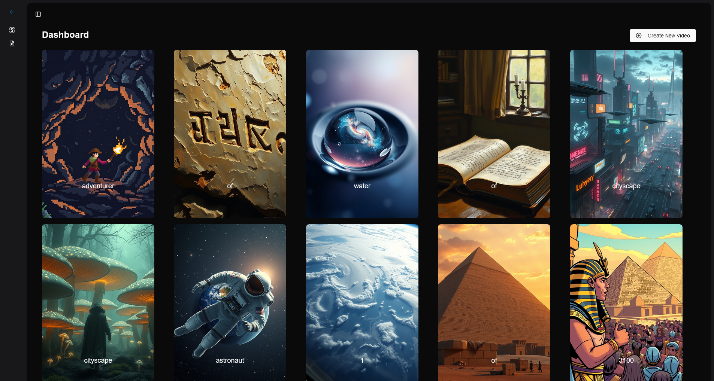
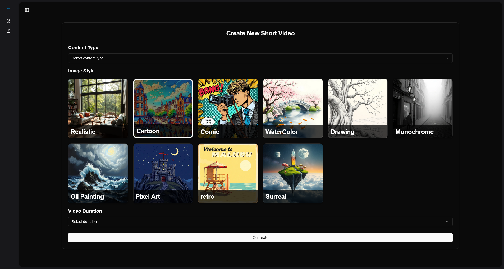
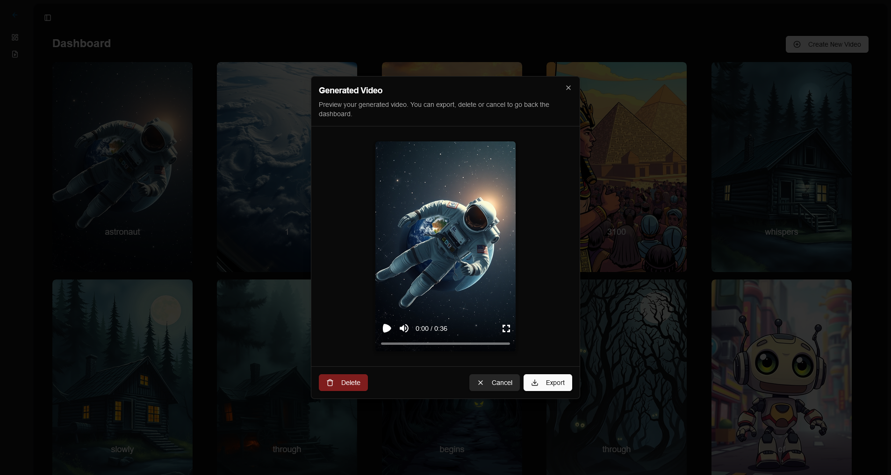

# AI Shorts Video Generator

This is a monorepo project that includes both the [frontend](./frontend/README.md) and [backend](./backend/README.md) for the AI Shorts Video Generator. The application allows users to generate short videos using AI, with features such as video creation, preview, and export. The frontend is built with Next.js, while the backend is built with ASP.NET Core and integrates with various AI services.

## Table of Contents

- [Features](#features)
- [Requirements](#requirements)
- [Installation](#installation)
- [Environment Variables](#environment-variables)
- [Development](#development)
- [Docker](#docker)
- [API Endpoints](#api-endpoints)
- [Dependencies](#dependencies)
- [Usage](#usage)

## Features

### Frontend

- **Video Creation**: Users can create short videos by selecting topics, styles, and durations.
- **Video Preview**: After generating a video, users can preview it with generated captions and images.
- **Video Deletion**: Users can delete the video from the database and the cloud if video was once rendered.
- **Export Video**: Users can export the generated video once the rendering is completed.
- **Theming**: Supports light and dark themes using `next-themes`.

### Backend

- **Content Generation**: Create video content based on user input using Google's Gemini API.
- **Audio Synthesis**: Convert text input to speech using Google Cloud Text-to-Speech API.
- **Caption Generation**: Generate captions for audio or video files using AssemblyAI.
- **Image Generation**: Generate images from text prompts using Cloudflare's AI API.
- **Video Storage**: Save and retrieve video data, including associated content and captions.

## Requirements

- Node.js (v22.x)
- [.NET 9 SDK](https://dotnet.microsoft.com/download/dotnet)
- [PostgreSQL](https://www.postgresql.org/download/) for the database. I used [Neon Serverless Postgres](https://neon.tech/)
- [Cloudinary](https://cloudinary.com/) account and API key
- [Cloudflare Workers AI](https://developers.cloudflare.com/workers-ai/) account and API key. I used [flux-1-schnell Model](https://developers.cloudflare.com/workers-ai/models/flux-1-schnell/)
- [AssemblyAI](https://www.assemblyai.com/) API key
- [Google Cloud Text-to-Speech](https://codelabs.developers.google.com/codelabs/cloud-text-speech-csharp) API Key
- [Gemini](https://ai.google.dev/gemini-api/docs#rest) API key

## Installation

1. Clone the repository to your local machine:

    ```bash
    git clone https://github.com/yourusername/AiShortsVideoGenerator.git
    cd AiShortsVideoGenerator
    ```

2. Install frontend dependencies:

    ```bash
    cd frontend
    npm install
    ```

3. Install backend dependencies:

    ```bash
    cd ../backend
    dotnet restore
    ```

## Environment Variables

Configure the following environment variables for both frontend and backend:

### Frontend (`.env`)

```plaintext
  NEXT_PUBLIC_API_URL=<Your API URL>
  REMOTION_AWS_SERVE_URL=<Your AWS Serve URL for Remotion>
  REMOTION_AWS_BUCKET_NAME=<Your AWS Bucket URL for Remotion>
```

Check the [Remotion setup lambda guide](https://www.remotion.dev/docs/lambda/setup) to get the `REMOTION_AWS_SERVE_URL` and `REMOTION_AWS_BUCKET_NAME` variables.

### Backend (appsettings.json)
```json
{
  "Logging": {
    "LogLevel": {
      "Default": "Information",
      "Microsoft.AspNetCore": "Warning"
    }
  },
  "GoogleApi": {
    "GeminiKey": "your-gemini-api-key",
    "TextToSpeechKey": "your-text-to-speech-api-key"
  },
  "AssemblyAi": {
    "ApiKey": "your-assemblyai-api-key"
  },
  "CloudinaryUrl": "your-cloudinary-url",
  "Cloudflare": {
    "ApiKey": "your-cloudflare-api-key",
    "AccountId": "your-cloudflare-account-id"
  },
  "ConnectionStrings": {
    "DefaultConnection": "your-postgresql-connection-string"
  }
}
```

## Development

### Frontend
To run the frontend application in development mode:

```bash
cd frontend
npm run dev
```

### Backend
To run the backend application:

```bash
cd backend
dotnet ef database update
dotnet run
```

## Docker
To run the application in Docker:

Configure the following environment variables:

(`.env.local`)

```plaintext
  NEXT_PUBLIC_API_URL=http://localhost:8080
```

Then run:

```bash
  docker compose up
```

## API Endpoints

- **GET /videos**: Retrieve a list of all videos stored in the database.
- **POST /generate-content**: Generate video content from user input using Google's Gemini API.
- **POST /generate-audio**: Convert text input to audio (MP3) using Google Cloud Text-to-Speech API.
- **POST /generate-captions**: Generate captions for an audio or video file using AssemblyAI.
- **POST /generate-image**: Generate an image from a text prompt using Cloudflare's AI API.
- **POST /save-video**: Save a video record to the database.
- **PUT /videos/{id}**: Update video Output File and Render Id.
- **DELETE /videos/{id}**: Delete video from the database.

## Dependencies

### Frontend

- **Next.js**: React framework for building server-side rendered applications.
- **TailwindCSS**: Utility-first CSS framework for styling the app.
- **Remotion**: Library for creating videos programmatically with React.
- **Axios**: HTTP client for making requests to the API.
- **shadcn**: A collection of re-usable components that you can copy and paste into your apps.

### Backend

- **Google.Cloud.TextToSpeech.V1**: Google Cloud Text-to-Speech client.
- **AssemblyAI**: Client library for AssemblyAI services.
- **CloudinaryDotNet**: Cloudinary SDK for uploading media.
- **Npgsql.EntityFrameworkCore.PostgreSQL**: PostgreSQL support for Entity Framework Core.

## Usage

- **Dashboard**: Users can view and manage generated short videos.

- **Create New Video**: Users can define the video topic, style, and duration, and the app will generate the video content, audio, captions, and images using AI.

- **Video Preview & Export**: After the video is generated, users can preview it in the dialog and export it once rendered.

